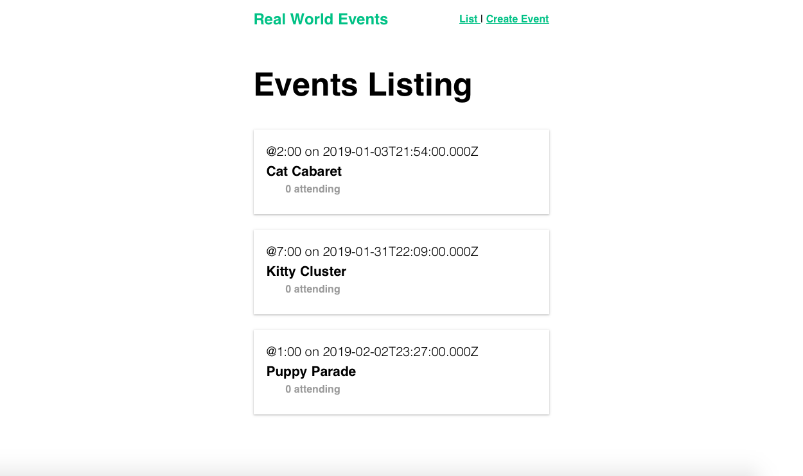

# Real World Events project
Vue Mastery's Real World Vue.js

This tutoral project covers topics such as the dynamic routing, api calls using axios, component modularity, and Single Page Application (SPA) in Vue.js, etc.



### Built with:
- Vue.js of course 😉
- axios
- lodash

For more info and documentation, visit https://vuejs.org

## Getting Started

For more detailed info on installation, see Vue.js [installation docs] (https://vuejs.org/v2/guide/installation.html)

## Using Vue CLI (you should have npm installed):

### 1. Install dependencies
`$ npm init` to install the necessary npm modules

### 2. Compile and hot-reload for development
`$ npm run serve`

### 3. Congrats! 
Your local development server will be running at http://localhost:8080/


## General project setup
```
npm install
```

### 
```
npm run serve
```

### Compiles and minifies for production
```
npm run build
```

### Lints and fixes files
```
npm run lint
```

## License
MIT

## Contributors
N/A

## Inspiration:
To learn Vue.js and support open-source development/projects
